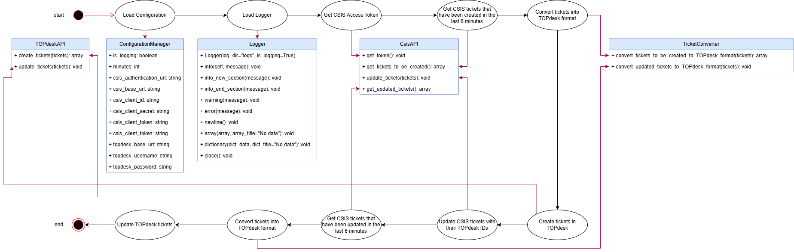

# CSIS to TOPdesk synchronization script

**Author**: Claudiu Mihai Jechel

## Description

This script operates in two steps:
1. Ticket Creation & Linking:
   - Retrieve all CSIS tickets created in the last n minutes.
   - Create corresponding tickets in TOPdesk.
   - Update the CSIS tickets with their respective TOPdesk ticket IDs.
2. Ticket Updates:
   - Retrieve all CSIS tickets updated in the last n minutes.
   - Apply the corresponding updates to their linked TOPdesk tickets.

**NOTES**:
- The value of n (minutes) is configurable via the environment file.
- In both steps, CSIS tickets must be converted to the TOPdesk format before processing.
- This can be manually run, but it's intended to run automatically using Azure Automations.
